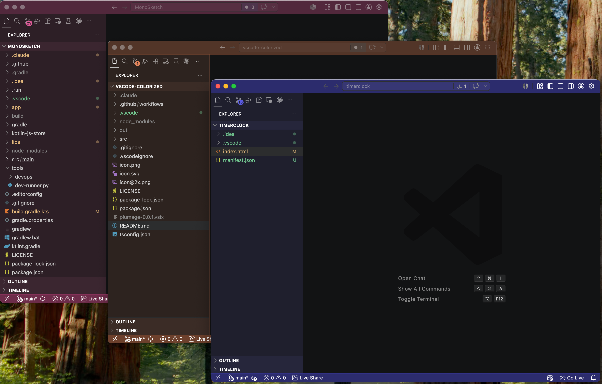

<p align="center">
  
</p>

<h1 align="center">Plumage</h1>

<p align="center">
  Automatically color the <b>title bar</b>, <b>activity bar</b>, <b>side bar</b>, and <b>status bar</b> of each VSCode window based on a hash of the workspace path. Theme-aware (light / dark), zero configuration.
</p>

<p align="center">
  <a href="https://marketplace.visualstudio.com/items?itemName=tuanchauict.plumage"></a>
  <a href="package.json"></a>
  <a href="LICENSE"></a>
</p>

<p align="center">
  
</p>

Built for people who keep ten VSCode windows open and can't tell which is which.

## Why not Peacock?

Peacock is manual and its default greens/oranges are loud. Plumage:

- Picks a color **automatically** from the workspace path — same project, same color, every time.
- Uses **14 hand-picked hues** that look good on both light and dark themes (no muddy yellow/amber).
- Keeps the side bar a **subtle tint** of the editor background instead of a wall of color.
- Reacts to **theme changes** — switch to light mode and the bars adjust.

## Install

**From the Extensions sidebar** — open VSCode, press `Cmd/Ctrl + Shift + X`, search for **Plumage**, click Install.

**From the command line:**

```sh
code --install-extension tuanchauict.plumage
```

**From the web:** https://marketplace.visualstudio.com/items?itemName=tuanchauict.plumage

After install, open any folder. The chrome will recolor on the next window — no setup needed.

## Usage

Plumage runs on startup. No setup. Open a folder and the chrome recolors.

### Commands (`Cmd/Ctrl + Shift + P`)

| Command | What it does |
| --- | --- |
| `Plumage: Refresh Colors` | Re-apply colors (e.g. after editing settings). |
| `Plumage: Shuffle (next color)` | Advance to the next color in the curated list if you don't like the default. |
| `Plumage: Pick Color...` | Quick-pick from all 14 colors. |
| `Plumage: Clear Colors` | Remove all Plumage-managed entries from `workbench.colorCustomizations`. |

### Settings

| Setting | Default | Description |
| --- | --- | --- |
| `plumage.enabled` | `true` | Toggle the extension on/off. |
| `plumage.hueOffset` | `0` | Integer offset added to the hash-derived color index. Bumped by Shuffle / Pick. |

## How it works

1. Hash the workspace's absolute path (FNV-1a 32-bit).
2. Map the hash to one of 14 curated hues: red, orange, lime, green, emerald, teal, cyan, sky, blue, indigo, violet, purple, magenta, pink.
3. Detect the active color theme (`vscode.window.activeColorTheme.kind`) and build a dark- or light-tuned palette.
4. Write the resulting colors into the workspace's `.vscode/settings.json` under `workbench.colorCustomizations`.

Only Plumage's own keys are touched — anything you've manually set is preserved.

## Build from source

```sh
git clone https://github.com/tuanchauict/vscode-plumage.git
cd vscode-plumage
npm install
npm run compile
```

Open the folder in VSCode and press `F5` to launch an Extension Development Host with the local build active. To produce an installable `.vsix`:

```sh
npx @vscode/vsce package
code --install-extension plumage-0.0.1.vsix
```

## License

MIT

---

<p align="center">
  <sub>
    <i><b>plumage</b> /ˈpluː.mɪdʒ/ (noun)</i> — a bird's covering of feathers, especially when vividly coloured.<br>
    Like a kingfisher's flash of blue or a peacock's iridescent fan, every workspace deserves its own.
  </sub>
</p>
